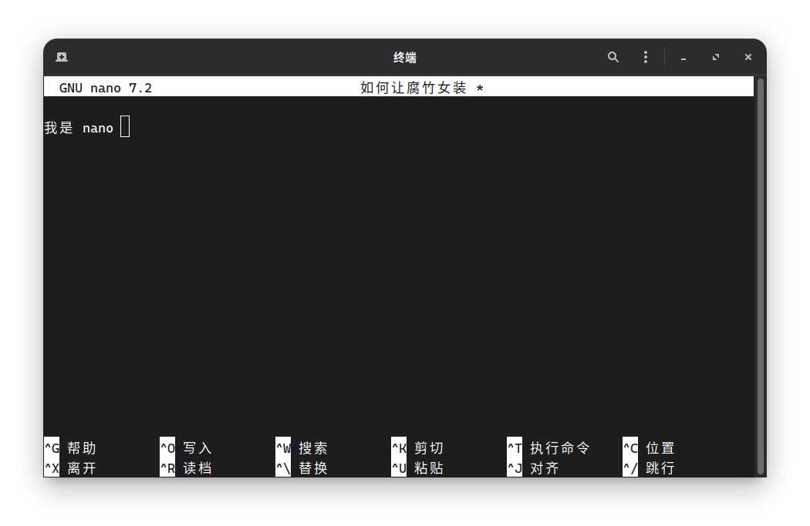

官网链接：https://www.nano-editor.org/

Nano 是一个简单易用的命令行文本编辑器，非常适合 Linux 初学者使用。如果你不会用 Vim 可以尝试使用 Nano。

使用 `nano 文件名` 打开一个已有文件或创建一个新文件，打开后即可直接开始编辑。编辑完成后，按下 `Ctrl+O` 保存文件（会提示确认文件名），然后按 `Ctrl+X` 退出编辑器。如果文件尚未保存，Nano 会提醒你是否保存。~~十分甚至九分的温馨。~~

Nano 的所有常用操作都显示在屏幕底部，例如 `^G` 表示 `Ctrl+G` 可获取帮助，`^X` 退出等。你还可以使用 `Ctrl+W` 搜索文本，`Ctrl+K` 剪切行，`Ctrl+U` 粘贴，~~十分甚至九分的方便。~~

Nano 是自由软件，遵循 GNU 通用公共许可证发布。
