import { Steps } from "@astrojs/starlight/components";

## 方法一：使用 AltStore

### （针对 Windows 用户，Windows 用户尚不支持在 iOS 17 上使用 AltJIT）

<Steps>

1. 点击此 [链接](https://www.i4.cn) 下载爱思助手电脑端并安装

2. 打开爱思助手，点击“工具箱->iTunes 及驱动->安装 iTunes”来安装 iTunes
   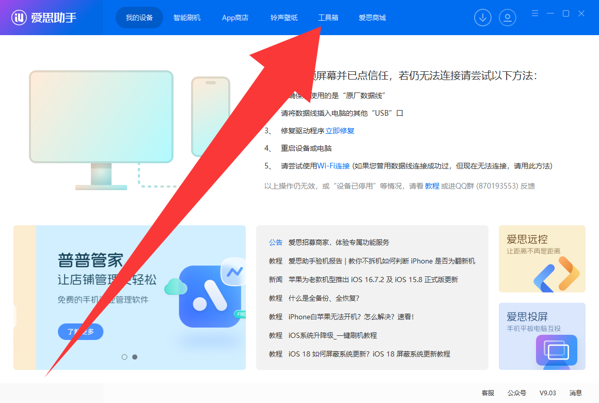
   
   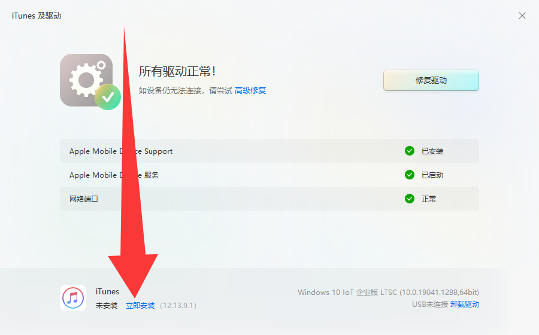

3. 点击此 [链接](https://updates.cdn-apple.com/2020/windows/001-39935-20200911-1A70AA56-F448-11EA-8CC0-99D41950005E/iCloudSetup.exe) 下载 iCloud 电脑端并安装

4. 点击此 [链接](https://cdn.altstore.io/file/altstore/altinstaller.zip) 下载 AltServer

5. 解压 AltInstaller.zip 并运行 Setup.exe

6. 将你的设备连接到电脑，并确保其已解锁。

7. 打开 iTunes，然后在设备上启用“通过 Wi-Fi 与此 iPhone 同步”
   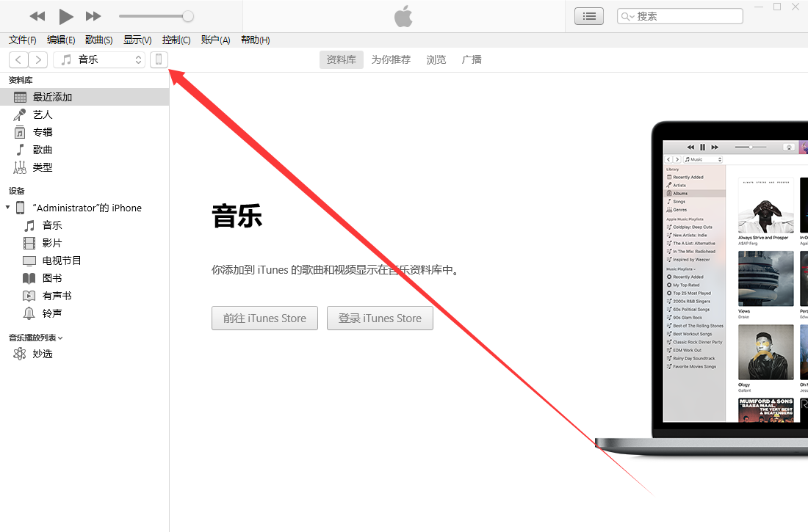
   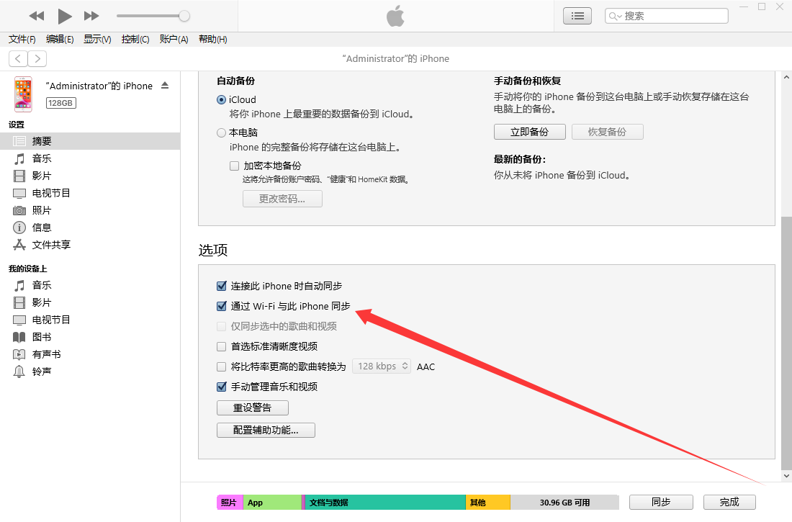

8. 点击右下角任务栏中的 AltServer 图标。然后前往“Install AltStore”，并选择你的 iOS 设备。

    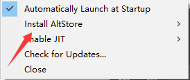

9. 输入您的 Apple ID 电子邮件地址和密码。

    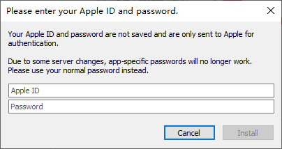

10. 等待几秒钟，然后会出现一个 AltServer 通知，提示 AltStore 已成功安装到您的设备上。

11. 在 iOS 设备上，前往“设置”->“通用”->“描述文件和设备管理”。点击“信任 您的 Apple ID”，然后再次点击“信任”进行确认。

    （要在 iOS 16 或更高版本上使用 AltStore，您需要前往“设置”->“隐私和安全”->“开发者模式”在设备上启用开发者模式。）

12. 从此 [链接](https://github.com/AngelAuraMC/Amethyst-iOS/actions) 下载 Amethyst 的 ipa 安装包。**（需要使用 GitHub 账号才能继续下载）**

</Steps>

### 手机开启 JIT

<Steps>

1. 打开“My Apps”选项卡，然后长按 Amethyst。

2. 按“Enable JIT”启动应用程序，几秒钟内您就会看到 AltStore 通知，提示 JIT 已启用。

</Steps>

### 电脑开启 JIT

<Steps>

1. 首先，确保 Amethyst 在设备前台运行。

2. 点击右下角任务栏中的 AltServer 图标。然后点击“Enable JIT”>您的设备，然后选择 Amethyst

</Steps>

## 方法二：使用 TrollStore

### 支持范围

| 设备类型                           | 支持系统版本范围                                       |
| ---------------------------------- | ------------------------------------------------------ |
| A8 处理器的 iPhone/iPad            | iOS/iPadOS 14.0 beta 2 ~ 15.8.4                        |
| A9-A11 处理器的 iPhone/iPad        | iOS/iPadOS 14.0 beta 2 ~ 17.0（不含 16.7.x RC 及以上） |
| A12-A17/M1-M2 处理器的 iPhone/iPad | iOS/iPadOS 14.0 beta 2 ~ 17.0（不含 16.7.x RC 及以上） |

### 安装 TrollStore

:::caution

以下方法支持固件版本 14.0 至 15.1.1 的所有 iOS/iPadOS 设备、固件版本 15.2 至 16.6.1 的 A9(X)，以及更高版本设备以及版本 17.0 beta 1 至 17.0 beta 4 的 A10 (X) 设备

:::

<Steps>

1. 点击此 [链接](https://www.i4.cn) 下载爱思助手电脑端并安装。

2. 将你的设备连接到电脑，并确保其已解锁。

3. 点击此 [链接](https://github.com/alfiecg24/TrollInstallerX/releases/latest/download/TrollInstallerX.ipa) 下载 TrollInstallerX。

4. 打开爱思助手，点击“工具箱->iTunes 及驱动->安装 iTunes”来安装 iTunes。

5. 在爱思助手中，点击“工具箱->IPA 签名->添加 IPA 文件”将你下载好的 TrollInstallerX 选中，之后点击打开

6. 在刚刚的 IPA 签名的窗口中，点击使用 Apple ID 签名，点击添加 Apple ID

7. 现在，在使用 Apple ID 窗口中，填写你的 Apple ID 和密码

8. 在 UDID（设备标识）中选择与你设备 UDID 相同的一项，点击确定

9. 选择 TrollInstallerX 和你刚才添加的 Apple ID，点击开始签名

10. 签名成功后点击打开已签名 IPA 位置，双击 TrollInstallerX.ipa，选择你的设备点击安装

11. 在你的设备上，前往“设置”->“通用”->“描述文件和设备管理”。点击“信任 [您的 Apple ID]”，然后再次点击“信任”进行确认

    （iOS 16 或更高版本上使用 TrollInstallerX，您需要前往“设置”->“隐私和安全”->“开发者模式”在设备上启用开发者模式。）

12. 打开 TrollInstallerX，点击“Install TrollStore”

13. 当提示要“install the persistence helper”请点击您 **最不经常使用的应用程序**

    （如果您不知道点击哪个应用，请选择 Tips）

14. 在适用于 A15、A16 和 M2 设备的 iOS 16.5.1 以及适用于 A12 及更高版本的设备的 iOS 16.6 至 16.6.1 上，

    你需要打开你安装的“persistence helper”并且点击 Install TrollStore

15. 从此 [链接](https://github.com/AngelAuraMC/Amethyst-iOS/actions) 下载 Amethyst 的 tipa 安装包。**（安装包需要使用 GitHub 账号才能继续下载）**

16. 打开 Amethyst

</Steps>

#### 以下方法支持 iOS/iPadOS 15.0 至 15.5 beta 4 和 15.6 beta 1 至 15.6 beta 3 A11 及更早版本的设备

#### iOS/iPadOS 14.0 beta 2 至 15.6.1 和 16.0 beta 1 至 16.0 beta 3 A12 及更高版本的设备

<Steps>

1. 打开 Safari

2. 在您的设备上打开此页面

3. 在您的设备上，使用 Safari 访问 `itms-services://?action=download-manifest&url=https://jailbreaks.app/cdn/plists/TrollHelper.plist`

4. 点击 Install

5. 一个名为的应用程序 GTA Car Tracker 现在将安装到您的设备上

6. 打开 GTA Car Tracker，点击 Register Persistence Helper，点击 Install TrollStore

    （如果重新启动，重新执行第六步）

7. 从此 [链接](https://github.com/AngelAuraMC/Amethyst-iOS/actions) 下载 Amethyst 的 tipa 安装包。**（tipa 安装包需要使用 GitHub 账号才能继续下载）**

8. 打开 Amethyst

</Steps>

#### 以下方法支持 iOS/iPadOS 16.7 RC、17.0 beta 5~17.0

<Steps>

1. 安装 Python3 最新版本，[官网下载地址](https://www.python.org/downloads/)。

2. 点击此 [链接](https://www.i4.cn) 下载爱思助手电脑端并安装。

3. 打开爱思助手，点击“工具箱->iTunes 及驱动->安装 iTunes”来安装 iTunes

    
    
    

4. 下载 [TrollRestore](https://github.com/JJTech0130/TrollRestore/releases/download/1.0/TrollRestore.exe)

5. 将你的设备连接到电脑，并确保其已解锁。

6. 打开文件资源管理器，找到下载/提取的文件的保存位置。

7. 双击 TrollRestore

8. 出现提示时，输入要覆盖的系统应用程序的名称，然后按回车键

    （如果您不确定要覆盖哪个应用程序，请通过输入覆盖 Tips 应用程序 Tips）

9. 解锁您的设备，打开你覆盖的系统应用程序，点击 Install TrollStore

10. 从此 [链接](https://github.com/AngelAuraMC/Amethyst-iOS/actions) 下载 Amethyst 的 tipa 安装包。**（在 GitHub Actions 需要使用 GitHub 账号才能继续下载）**

11. 打开 Amethyst

</Steps>

## 方法三：牛蛙助手

~~虽然简单但是不推荐，因为广告太多了~~

<Steps>

1. 点击 [这里](https://ios222.com/) 下载牛蛙助手

2. 点击此 [链接](https://www.i4.cn) 下载爱思助手电脑端并安装

3. 打开爱思助手，点击“工具箱->iTunes 及驱动->安装 iTunes”来安装 iTunes

    
    
    

4. 打开牛蛙助手，将你的苹果设备链接至电脑（先把设备解锁）

5. 点击“立即安装”

6. 打开手机上的牛蛙助手

7. 点击一下->允许->设置->已下载描述文件->安装->输入手机密码->安装->安装

8. 打开手机上的牛蛙助手，点击 IPA 签名->证书->右上方的“+”->apple 证书

9. 输入你的 appleID 和密码，点击确定

10. 从此 [链接](https://github.com/AngelAuraMC/Amethyst-iOS/actions) 下载 Amethyst 的 ipa 安装包。**（需要使用 GitHub 账号才能继续下载）**

11. 点击文件管理->右上方的“+”->导入资源，导入你刚才下载的 IPA 文件

12. 点击应用->找到 Amethyst，点击它->签名

13. 找到“已签名”点击一下->找到 Amethyst，点击它->点击安装->点击安装

14. 回到牛蛙助手的主页->JIT->找到 Amethyst，点击它->点击使用 JIT 启动

    （iOS/iPadOS 16+ 记得前往“设置”->“隐私和安全”->“开发者模式”在设备上启用开发者模式。）

</Steps>

## 方法四：越狱

:::caution

本文档不对你的设备安全负责

请你在知道你在做什么的情况下，使用越狱的方法

（越狱可以获得手机最高权限）

:::

| 越狱名称                                    | 支持版本 (iOS/iPad OS) | 支持芯片      |
| ------------------------------------------- | ---------------------- | ------------- |
| [Electra](https://coolstar.org/electra/)    | 11.0~11.1.2            | A9-A11        |
| [Chimera](https://chimera.coolstar.org/)    | 12.0~12.5.5            | A9~A12        |
| [Odyssey](https://theodyssey.dev/)          | 13.0~13.7              | A9~A13        |
| [Unc0ver](https://unc0ver.dev/)             | 11.0~14.8              | A9~A14        |
| [Taurine](https://taurine.app/)             | 14.0~14.8.1            | A9~A12        |
| [Dopamine](https://ellekit.space/dopamine/) | 15.0~16.6.1\*          | A12~A16,M1,M2 |
| [Checkra1n](https://checkra.in/)            | 12.0~15.4.1            | A7~A11        |
| [Palera1n](https://palera.in/)              | 15.0~?                 | A7~A11        |

\*Dopamine 到 iOS 16.6 - 16.6.1 不支持 A12 及更新版本的设备，iOS 16.5.1 - 16.6.1 不支持 A15-A16/M2 版本的设备。

除了 Palera1n 和 Checkra1n 需要使用 U 盘或者 Linux 或者 macOS，其他基本上就是签名 -> 安装 -> 打开 -> 点 jailbreak 就可以了

基本上就是 **安装 TrollStore** 第一个方法 1~11 步

### 使用 Palera1n

<Steps>

1.  你需要一个 U 盘（大于 32GB，重要数据已经备份）[Rufus](https://rufus.ie) 或者 [Ventoy](https://www.ventoy.net) 还有 Palera1n 的 ISO 镜像文件，并且把他们下载到你的计算机上

2.  打开 Rufus，在“设备”里面选择你的 U 盘，在“引导类型选择”里面选择镜像文件，点击“选择”选择你下载的 Palera1n 的 ISO 镜像文件

    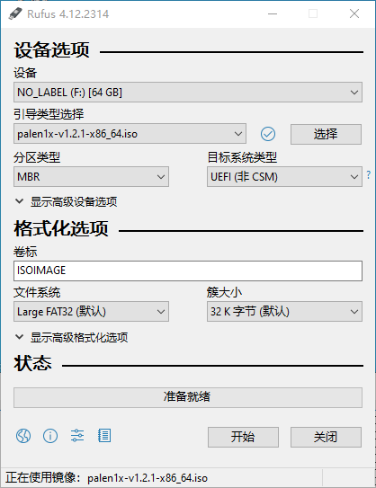

3.  然后点击“开始”，选择以 DD 模式写入，点击“OK”

    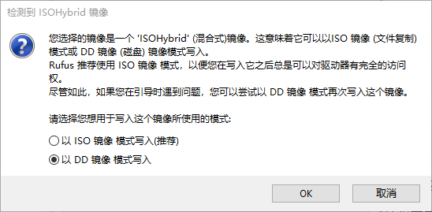

4.  重启你的电脑到恢复模式，点击“疑难解答”，点击“高级选项”，点击 UEFI 固件设置（Win10 以后）

    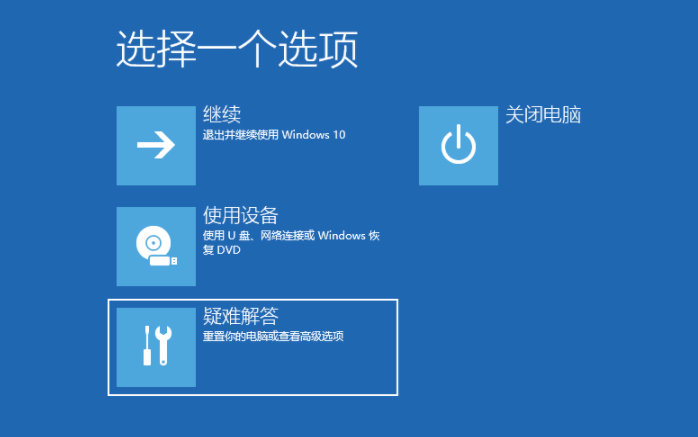

    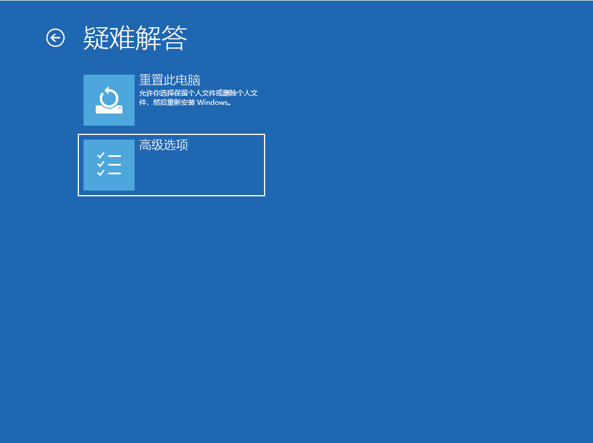

    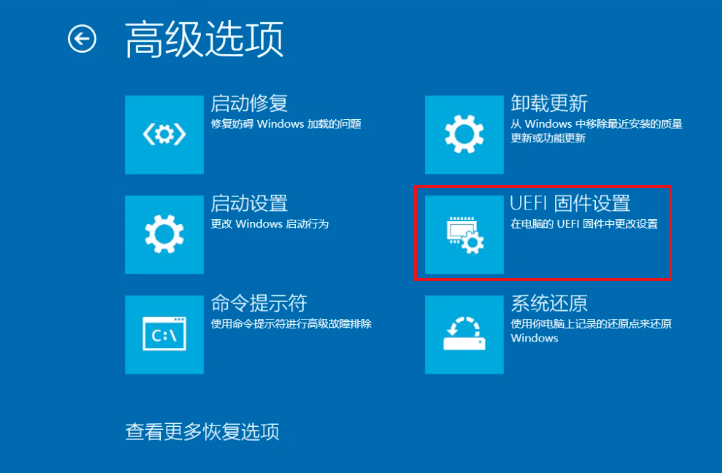

    或者在开机时按下 BIOS 启动键

5.  找到“Boot”或者“启动”选项卡，把你的 U 盘的启动顺序调整到第一

6.  连接你的设备到电脑，点击两次回车，使设备进入 DFU 模式（屏幕上会有提示）

        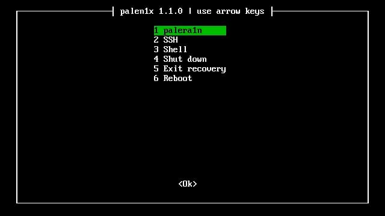
        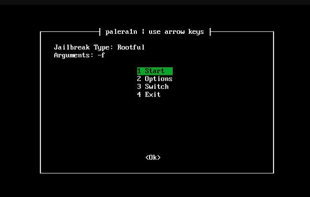

</Steps>
