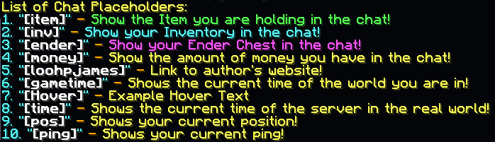
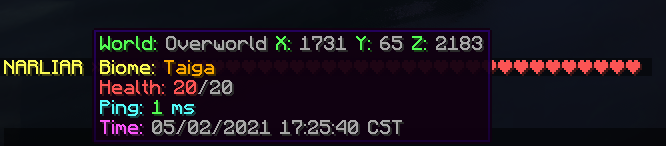

:::note
聊天增强插件，可以基于你的聊天格式插件，添加诸如分享物品和物品栏等功能，并创建自定义聊天占位符。
:::

- 物品展示：在聊天中输入 [item]、[inv]、[ender] 等关键词，可向其他玩家展示手中的物品、背包或末影箱内容，并支持自定义布局。

- 自定义交互关键词：允许创建自定义占位符，为关键词添加悬停提示、点击动作或替换为任意文本。

- 玩家名称交互：将聊天中的玩家名字替换为可交互内容（如悬停显示信息、点击执行命令），并兼容昵称插件。

- 玩家提及通知：当玩家名字被提及时，通过声音、标题、动作栏等方式提醒该玩家，支持跨服务器提醒。

- 跨服务器支持：基于 BungeeCord 或 Velocity，所有功能（展示、提及、自定义占位符）可在全球聊天网络中跨服务器工作。

- RGB 颜色与字体：支持在配置和聊天中使用 RGB 颜色代码（如 &#123456）和自定义资源包字体，增强视觉效果。

- 多语言自动翻译：插件消息可自定义，物品名称会根据玩家客户端语言自动翻译显示。

