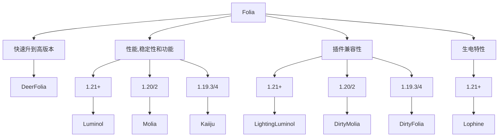

Folia 是 Paper 的一个分支，由 Spottedleaf 开发。

:::danger

Folia 不适合新手，新手无论如何都不要考虑

:::

## 简介

### 好处

Folia 与 Vanilla 最大的不同在于 Tick 不再有主线程，而是将区块进行分组，每个独立的区域都有自己的 Tick Loop

如果你无法理解这段话，你可以看这样子做的好处：

现在有一个地图，有四个区块，分别是 A，B，C，D

小明在 A 处建造了一个卡服机，能把服务器 TPS 干到 10 以下的那种

如果是 Paper(或者 Purpur 及其分支)，那么 A，B，C，D 四处的 TPS 都会掉到 10 以下

但如果我们用 Folia (假设 ABCD 分在不同的 Region)，那么只有 A 处的 TPS 会掉到 10 以下，B，C，D 的 TPS 仍然不受影响

并且 Folia 可以更好的利用 CPU 多核

### 坏处

Folia 完全破坏了 Bukkit 插件的兼容性，每个 Bukkit 插件都必须为 Folia 做兼容 (有专门的 Fork 为 Folia 做 Bukkit 插件兼容，后面会讲)，所以，Folia 目前只支持很少插件

## 要求

Folia 这么好，但并不是每个服务器都可以体验的，你需要确保你的服务器符合以下条件，这样才可以从 Folia 中受益

- 16 个 **物理** CPU 核心
- 玩家较为分散 (生存多人游戏、无政府、空岛或一些迷你游戏服务器)
- 你需要的插件支持 Folia

如果你不符合，去用 Leaf 吧，符合的话继续看下去！

## 分支选择

Folia 有许多分支，每个分支都有不同的特点和适用场景。根据你的需求选择合适的分支：

## 推荐分支

根据上述流程图选择合适的分支后，你可以查看对应的详细文档：

### 主要分支

- **[Luminol](/java/start/server-core-choose/folia/luminol)** - 性能、稳定性和功能的最佳平衡，包含 Lophine 生电分支 (1.21+)
- **[其他分支](/java/start/server-core-choose/folia/misc)** - 包含 Molia、DeerFolia、Kaiiju 等

### 快速下载

如果你已经确定要使用的分支，可以直接从以下镜像下载：

- [Folia](https://mcres.cn/downloads/folia.html)
- [Luminol & Lophine](https://mcres.cn/downloads/luminol.html)
- [更多分支下载](/java/start/server-core-choose/folia/misc)
