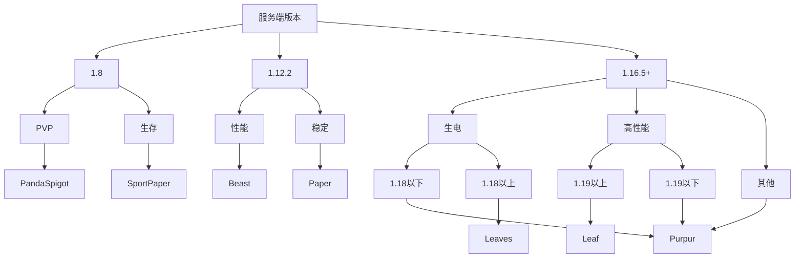
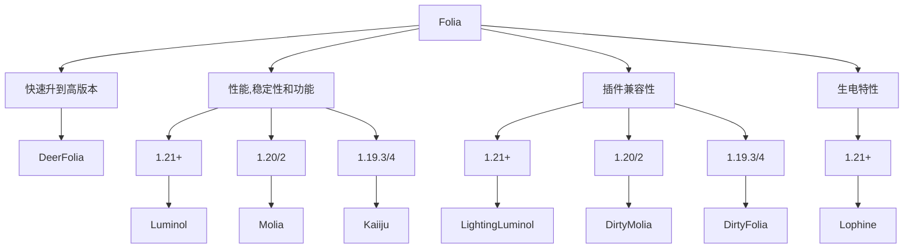

如果你不知道怎么选，我们为你提供一个简单的方法：

## 高版本

import { TabItem, Tabs } from "@astrojs/starlight/components";

<Tabs>
<TabItem label="Paper">

**优势**：

- 性能 - 性能还可以
- 稳定 - 目前最稳定的核心
- 兼容 - 很多插件会以此核心为标准之一进行兼容

**劣势**：

- 性能 - 在高版本逐渐比不过他的分支
- 特性 - 丧失不少原版特性

总的来说，Paper 核心适合那些追究 _极端的_ 稳定的人

- 官方英文文档 [点我](https://docs.papermc.io/paper)
- 笨蛋汉化文档 [点我](https://paper.8aka.org/paper)

**下载**：

- [官方](https://papermc.io/downloads/all)
- [FastMirror](https://www.fastmirror.net/#/download/Paper)
- [McRes](https://mcres.cn/downloads/paper.html)
- [原子云](https://res.nullatom.com/Minecraft/Server/Paper/)
- [MCSL](https://sync.mcsl.com.cn/core/Paper)

</TabItem>
<TabItem label="Purpur">

**优势**：

- 性能 - Purpur 的性能相比于 Paper 提升大约 10-20%，略有提升
- 稳定 - Purpur 兼容 Paper 的全部插件，只要 Paper 能跑，Purpur 就可以跑
- 特性 - Purpur 还原了 Minecraft 的部分特性，用来开生存服务器更加适合 (当然生电还是得 Leaves)
- 兼容 - 很多插件会以此核心为标准之一进行兼容
- 功能 - 配置文件中有一些基础插件的功能，合理使用可以减少插件使用量。

**劣势**：

- 配置 - 配置文件比较繁杂
- 支持 - 只有部分 MC 版本的构建

综上所述，目前 Purpur 是综合最优选择

- 官方英文文档 [点我](https://purpurmc.org/docs/purpur)
- 笨蛋汉化文档 [点我](https://purpur.8aka.org/purpur)

**下载**：

- [官方](https://purpurmc.org/downloads)
- [McRes](https://mcres.cn/downloads/purpur.html)
- [FastMirror](https://www.fastmirror.net/#/download/Purpur)
- [MCSL](https://sync.mcsl.com.cn/core/Purpur)

</TabItem>
<TabItem label="Leaves">

**优势**：

- 特性 - 为生电而生，拥有专门的生电向特性支持
- 兼容 - 支持 Paper 能使用的几乎所有插件
- 支持 - 国人开发的核心

**劣势**：

- 优化 - 优化不如 Purpur 和 Leaf

专为生电而生的核心。

Leaves 基本完全支持客户端生电 mod，包括但不限于 Carpet、PCA、投影、共享原理图、MiniHUD、BBOR、OMMC、Xaero 小地图、Jade、AppleSkin。

[点我](https://docs.leavesmc.org/zh_Hans) 查看 Leaves 官方文档

**下载**:

- [官方](https://leavesmc.org/downloads/leaves)
- [McRes](https://mcres.cn/downloads/leaves.html)
- [MCSL](https://sync.mcsl.com.cn/core/Leaves)
- [Leaves 1.18.2](https://vip.123pan.cn/1821558579/6492009)

</TabItem>
<TabItem label="Leaf">

**优势**：

- 性能 - 比 Purpur 好的多的性能（在实体方面甚至能达到 50% 以上的提升）
- 支持 - 国人开发的核心

    对插件的兼容程度：Paper = Purpur > Leaf /Leaves

**劣势**：

- 兼容 - 有极少插件不兼容 (可向核心作者反馈)

总的来说，相比 Purpur 会有更好的优化，极少不兼容的插件可以及时找作者反馈，所以非常推荐此核心

[点我](https://www.leafmc.one/zh/docs) 查看 Leaf 官方文档

**下载**：

- [官方](https://www.leafmc.one/zh/download)
- [McRes](https://mcres.cn/downloads/leaf.html)

</TabItem>
<TabItem label="Folia">

:::danger

Folia 不适合新手，新手无论如何都不要考虑 [（其详细内容会在下一章介绍）](/java/start/server-core-choose/folia/intro/)

:::

**优势**：

- 性能 - 为服务器增加了区域化多线程

**劣势**：

- 兼容 - 目前只支持很少插件

**选择**：

Folia 有许多分支，每个分支都有不同的特点和适用场景。根据你的需求选择合适的分支：

**下载**：

- [Folia](https://mcres.cn/downloads/folia.html)
- [Luminol & Lophine](https://mcres.cn/downloads/luminol.html)
- [更多分支下载](/java/start/server-core-choose/folia/misc)

</TabItem>
</Tabs>

## 其他

:::tip

对于 1.8，目前仅有 1.8.8 版本的核心，而没有 1.8.9

1.8.8 与 1.8.9 区别小到安装 [ViaVersion](/java/process/plugin/misc/via/intro) 之后感觉不到区别

:::

<Tabs>
<TabItem label="PandaSpigot （ 1.8 ）">

**优势**：

- 性能 - 拥有较好的性能
- 维护 - 可用于开 PVP 服务器，含大量 konckback 配置选项
- 维护 - 专为 1.8 提供维护

**劣势**：

- 还没想到

**下载**：

- [官方](https://nightly.link/hpfxd/PandaSpigot/workflows/build/master/Server%20JAR.zip)
- [McRes](https://vip.123pan.cn/1821558579/Lingyi/core/pandaspigot-116-mcres.cn.jar)

</TabItem>
<TabItem label="SportPaper（ 1.8 ）">

**优势**：

- 性能 - 拥有较好的性能
- 维护 - 可用于开生存服务器，很多生存配置选项

**劣势**：

- 还没想到

**下载**：

- [官方](https://github.com/Electroid/SportPaper)
- [McRes](https://vip.123pan.cn/1821558579/6492156)

</TabItem>
<TabItem label="Beast （ 1.12 ）">

**优势**：

- 性能 - 1.12 相比高版本本身吃资源就少，此核心提供更多优化
- 维护 - 专为 1.12 提供维护，修复错误和改进

**劣势**：

- 还没想到

**下载**：

- [官方](https://github.com/HomoMC/Beast)
- [McRes](https://vip.123pan.cn/1821558579/6492155)

</TabItem>
</Tabs>

## 不推荐

:::danger

以下核心真的不推荐，除非你真的疯了，否则不要用

:::

| 名称                                                      | 介绍                                     |
| --------------------------------------------------------- | ---------------------------------------- |
| [CraftBukkit](https://getbukkit.org/download/craftbukkit) | 插件端鼻祖核心，无优化                   |
| [Spigot](https://getbukkit.org/download/spigot/)          | CraftBukkit 的分支，有一点优化，仍不推荐 |
